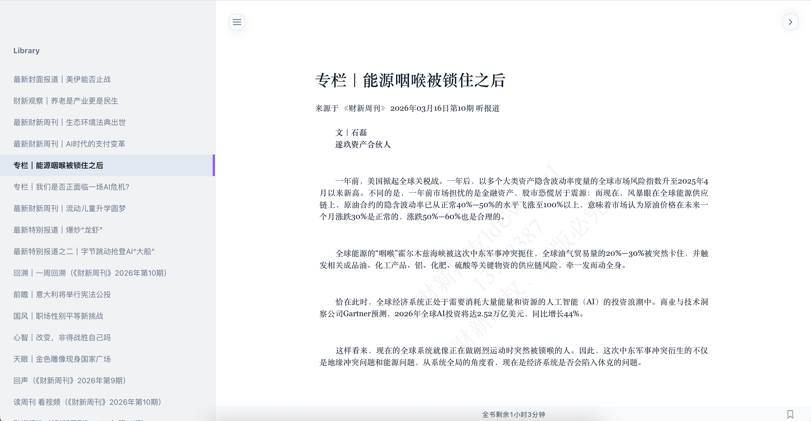
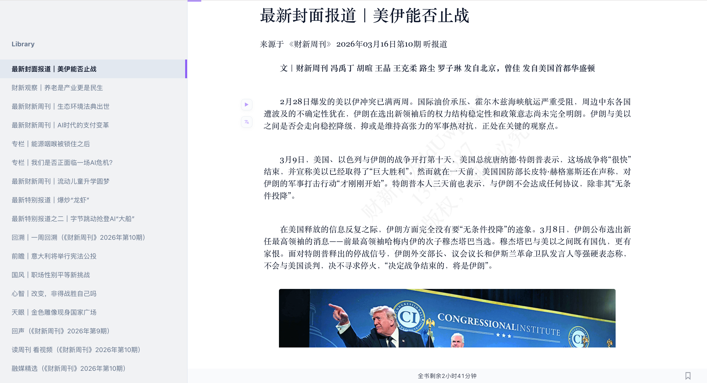

# Caixin Downloader

财新周刊全自动 EPUB 下载引擎 —— 一键将已订阅的《财新周刊》打包为排版精美的离线电子书。

## 阅读效果

| 目录导航 + 文章排版 | 图文混排 + 封面图片 |
|:---:|:---:|
|  |  |

## 前置条件

- **财新付费会员**：本工具仅辅助下载你已付费订阅的内容，不能绕过付费墙
- **Python 3.10+**
- **uv**（Python 包管理器）：[安装指南](https://docs.astral.sh/uv/getting-started/installation/)

## Cookie 获取教程

本工具需要你的财新登录 Cookie 来访问付费内容。请按以下步骤操作：

### 第 1 步：安装浏览器插件

| 浏览器 | 推荐插件 | 安装链接 |
|--------|----------|----------|
| Chrome | EditThisCookie | [Chrome 应用商店](https://chromewebstore.google.com/detail/editthiscookie/fngmhnnpilhplaeedifhccceomclgfbg) |
| Firefox | Cookie-Editor | [Firefox 附加组件](https://addons.mozilla.org/firefox/addon/cookie-editor/) |

### 第 2 步：登录财新网

1. 打开浏览器，访问 [weekly.caixin.com](https://weekly.caixin.com/)
2. 使用你的付费账号登录
3. 确认可以正常阅读付费文章（点开任意一篇文章，能看到全文即可）

### 第 3 步：导出 Cookie

1. 在财新网页面上，点击浏览器工具栏中的 Cookie 插件图标
2. 点击 **导出 / Export**（选择 JSON 格式）
3. 将导出的内容保存为项目根目录下的 `cookies.json` 文件

> Cookie 有效期一般为数天到数周，失效后重复上述步骤更新即可。

## 安装与运行

```bash
# 1. 克隆项目
git clone https://github.com/hainingyu/caixin-downloader.git
cd caixin-downloader

# 2. 安装依赖（含 Playwright 浏览器）
uv run playwright install chromium

# 3. 将导出的 Cookie 放到项目根目录
# （确保 cookies.json 已就位）

# 4. 验证 Cookie 是否有效
uv run python test_caixin.py

# 5. 运行下载
uv run python main.py
```

运行后会出现交互式界面，选择想下载的期数，回车即开始下载。生成的 EPUB 文件保存在 `download/` 目录。

## 功能特性

- **自动探测最新期号**，支持历史期刊翻页选择和批量下载
- **封面自动获取**，EPUB 内嵌当期杂志封面
- **图片离线嵌入**，断网也能阅读完整图文
- **杂志级排版**：1.85 倍行高、两端对齐、首段去缩进，适配 Kindle / iPad 双页模式
- **自定义目录页 + 空白过渡页**，在双页模式下目录与正文物理隔离
- **智能重试**和并发控制，稳定抓取 20~30 篇/期
- **Rich 终端界面**，带进度条和彩色输出

## 免责声明

- 本工具仅供个人学习和研究使用，需配合财新付费会员使用
- 下载内容的版权归 **财新传媒 (Caixin Media)** 所有
- 严禁将下载内容用于商业用途或公开传播
- 用户需自行承担因不当使用本工具而产生的一切法律责任
- 请在下载后 24 小时内删除

## License

[MIT](LICENSE)
